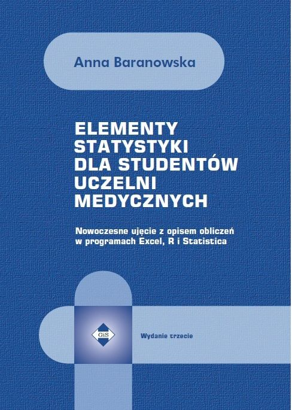
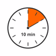
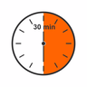

```{r setup, include=FALSE }
knitr::opts_chunk$set(echo = F, warning=F)

library(ggplot2)
library("dplyr")
library("tidyr");
library("tidyverse")
library("RColorBrewer")
library("ggpubr")

```
 
## Statystyka medyczna: przegląd literatury

{width=25%}

Antyreklama wydawnictwa UJ.


120 stron za 68 zł. Beznadziejna książka (ciemno i niezrozumiale). 
Coś w rodzaju tezaurusa pojęć statystycznych. 
Z czegoś takiego nikt się niczego nie nauczy.



Dobra książka, ale nie dla studentów pielęgniarstwa. Poziom zaawansowany.
Nasycenie wzorami 90%. (Autorka jest matematykiem z wykształcenia)


Dobra książka, ale dla studentów studiów doktoranckich.
Dużo teorii, za mało konkretów i praktyki.

Podsumowanie: rekomendowanych książek -- **0**


## Statystyka na kierunku Pielęgniarstwo ≠ Statystyka medyczna

Dużo zapożyczeń z Psychologii, Pedagogiki i Nauk o Zarządzaniu (PPNoZ), 
a **królową pomiaru** jest ankieta

Trzy typowe sposoby napisania pracy magisterskiej: 

* opis czegoś (słabe), 

* zweryfikowanie jakiegoś modelu opartego na teorii z PPNoZ

  `google://MBI+wypalenie+praca+pielęgniarstwo`

* ocena stanu wiedzy i jego przyczyn na jakiś temat.

  `google://"wiedza na temat"+OR+"ocena poziomu wiedzy"+AND+pielęgniarstwo`

## Etapy analizy statystycznej

1. Cel ➔ Pomiar ➔ Ankieta 

  + Jeżeli cel jest luźno związany z pomiarem, to wynik końcowy nie
    może być dobry (a tak często bywa);
  
  + „ile pytań wystarczy?”

  + ankieta zawierająca pytania zupełnie nie dotyczące celu/hipotez, czyli **zbędne**

2. Analiza ➔ Metoda 

Jeżeli ograniczona to elementarnych metod nie jest rzeczą niemożliwą
do opanowania

3. Program 

Najprostszy. Inne (w tym arkusz uważany za łatwy) 
wymagają zaporowej ilości czasu żeby je opanować

**Kluczowe jest 1. Resztę można kupić**

## Oprogramowanie

* SAS/SPSS: PeEsWu nie ma licencji (i być może to jest błąd)

* Excel: skomplikowane, niewygodne, pracochłonne

* **Jamovi/Jasp**: względnie proste **ale**...

Chcę przedstawić Formularze Google/Arkusze Google do zbierania/wstępnej obróbki
danych + **Jamovi/Jasp** do analizowania danych

## Podstawy statystyki

https://hrpunio.github.io/SMI_Bookdown/przedmiotbadan.html

* rozdział 4: 7 <del>jeźdźców apokalipsy</del> metod badania zależności pomiędzy zmiennymi:
  + Wykres rozrzutu 
  + Tablica wielodzielna i test chi-kwadrat 
  + Współczynnik korelacji liniowej Pearsona
  + Współczynnik korelacji Spearmana
  + Regresja liniowa
  + Regresja logistyczna
  + Testy porównujące średnie w grupach (t-Welcha/ANOVA) lub rozkłady (U Manna-Whitneya, Kruskala-Wallisa.)

## Podstawy ankietologii

* rozdział 5: typowa scena rodzajowa

-- jak Państwo oceniają ankietę (którą przed chwilą wypełniali)

-- OK, ale pytania się powtarzały

-- niemożliwe, mogły być [znaczeniowo] podobne, ale na pewno nie było dwóch
   jednakowych

-- no tak...


## Przykład 1 (model zapożyczony z teorii PPNoZ):

Nastawienie względem statystyki

Czy studenci studiów pielęgniarskich obawiają się statystyki i jakie są tego przyczyny?

Na gruncie teorii psychologicznych można zdefiniować **Nastawienie względem statystyki** jako ogólny stosunek, jaki dana osoba ma do statystyki jako dziedziny wiedzy. Obejmuje ono emocje, przekonania i zachowania związane z tym przedmiotem:

**emocje**: jakie emocje dana osoba odczuwa wobec statystyki (np. lęk, zainteresowanie, przyjemność, frustracja)

**przekonania poznawcze**: co dana osoba sądzi na temat statystyki, na przykład o jej użyteczności czy znaczeniu w codziennym życiu, nauce lub pracy

**intencje behawioralne**: Jak bardzo dana osoba jest skłonna angażować się w naukę lub stosowanie statystyki, np. uczestniczyć w kursach statystyki, rozwiązywać zadania lub stosować metody statystyczne w praktyce.


Także na gruncie psychologii znana jest klasyczna **teoria samoskuteczności**, zaproponowana przez Alberta Bandurę, który uważał, że to, jak postrzegamy własne kompetencje, znacząco wpływa na nasze zachowania, decyzje i wyniki działań. Samoskuteczność (self-efficacy) to przekonanie jednostki o jej zdolności do skutecznego wykonywania określonych zadań lub osiągania celów. Albo wiara we własne umiejętności.

Sprawność matematyczna (osoby bieglejsze w matematyce będą miały bardziej pozytywne nastawienie)

Płeć (panie będą miały bardziej pozytywne nastawienie niż panowie lub odwrotnie)

Wiek (starsi bardziej docenią statystykę, lub odwrotnie)

Czyli definiujemy tzw. hipotezy szczegółowe:

sprawność matematyczna, płeć, wiek i samoskuteczność determinują **Nastawienie względem Statystyki**

**Materiał i metoda**:

Nastawienie mierzono za pomocą kwestionariusza  składającego się z 28 pytań, które mierzą cztery różne jego aspekty: afekt (a), kompetencje poznawcze (k), wartość (w) i trudność (t).

Samoskuteczność mierzono za pomocą kwestionariusza zawierającego 10 pytań

Ankieta: https://docs.google.com/forms/d/e/1FAIpQLSd46zEcAdOwixhjV0vzik5xFhS2XtvaHT2n5FD037BAO1pD9A/viewform?usp=sf_link

Przekształcenie danych na potrzeby analizy statystycznej:
https://youtu.be/PFueKqOc0wk


Analiza za pomocą programu Jamovi: https://youtu.be/vB9VeFJzWG8

## Przykład 2 (test kompetencyjny):

Wiedza na temat szkodliwości palenia i jej uwarunkowania wśród studentów PSW

Celem jest ocena wielkości zjawiska palenia tytoniu oraz
poziom wiedzy na temat szkodliwości palenia tytoniu
wśród
studentów PSW oraz zweryfikowanie wpływu wybranych czynników warunkujących ten nałóg.

Postawiono następujące hipotezy badawcze:

1. Jaka jest wielkość zjawiska palenie tytoniu wśród studentów PSW?

2. Jaka jest wiedza na temat szkodliwości palenia tytoniu wśród studentów PSW?

3. Czy palenie jest skorelowane z płcią, stażem pracy i miejscem pracy?

4. Czy wiedza na temat szkodliwości palenie jest skorelowana z płcią, stażem pracy i miejscem pracy?

5. Czy palenie jest skorelowane z wiedzą na temat szkodliwości palenia?

Ankieta https://docs.google.com/forms/d/e/1FAIpQLSeP6ujUK1Rdm8fh34JGztUFR2Jso9ZMgfppE4PewNVbLxIpKQ/viewform?usp=sf_link

Przekształcenie danych na potrzeby analizy statystycznej:
 https://youtu.be/lVZKNUuNrqY
 
Analiza za pomocą programu Jamovi:
 https://youtu.be/xskMSqaUIW0


## Złote myśli na zakończenie

* Repozytorium skal pomiarowych?

* Dołączanie zbiorów danych do pracy magisterskiej, być może w formie
  łagodnej perswazji,  np. chcesz brać udział w konkursie na najlepszą pracę dostarcz dane.
  
  + Dlaczego wyróżnione prace magisterskie nie są publicznie dostępne?

* Kanał na YT (uczelniany) zawierający materiały dydaktyczne


* https://github.com/hrpunio/JamoviStuff (albo: https://rpubs.com/hrpunio/1241678)


